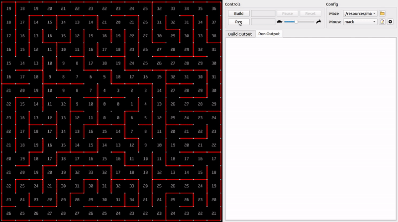

# mms <a href="https://www.buymeacoffee.com/mackorone"></a>



## Table of Contents

1. [Introduction](https://github.com/mackorone/mms#introduction)
1. [Download](https://github.com/mackorone/mms#download)
1. [Quick Start](https://github.com/mackorone/mms#quick-start)
1. [Mouse API](https://github.com/mackorone/mms#mouse-api)
1. [Scorekeeping](https://github.com/mackorone/mms#scorekeeping)
1. [Cell Walls](https://github.com/mackorone/mms#cell-walls)
1. [Cell Color](https://github.com/mackorone/mms#cell-color)
1. [Cell Text](https://github.com/mackorone/mms#cell-text)
1. [Reset Button](https://github.com/mackorone/mms#reset-button)
1. [Maze Files](https://github.com/mackorone/mms#maze-files)
1. [Building From Source](https://github.com/mackorone/mms#building-from-source)
1. [Related Projects](https://github.com/mackorone/mms#related-projects)
1. [Citations](https://github.com/mackorone/mms#citations)
1. [Acknowledgements](https://github.com/mackorone/mms#acknowledgements)

## Introduction

*mms* is a Micromouse simulator.

It makes it easy to write and test maze-solving code without a physical robot.

With it, you can:

* Test how your robot would behave in a real maze
* Visualize what your robot is thinking
  * Show known/unknown walls
  * Set the color of the cells
  * Display ASCII text on the cells
* Simulate a crash-and-reset scenario
* Test your algorithm on custom maze files
* Write code in any language you want

Previous versions of *mms* exist in the `old/` directory.

For information about Micromouse, see the [Micromouse Wikipedia page](http://en.wikipedia.org/wiki/Micromouse).

## Download

You can download pre-compiled binaries from the
[releases](https://github.com/mackorone/mms/releases) page. Simply download the
asset corresponding to your platform:

- Windows: Download and unzip `windows.zip` and run the "mms" exe
  - Note: you may get a warning like "Microsoft Defender SmartScreen prevented
    an unrecognized app from starting. Running this app might put your PC at
    risk." To get past that warning, click "More info" and then "Run anyway"

- macOS: Download and unzip `macos.zip` and run the "mms" app
  - Note: you may get warnings about running an application from an
    unidentified developer. To get past those warnings, control-click on the
    app and select "Open" (as opposed to simply double-clicking on the app).

If pre-compiled binaries for your platform are unavailable, you'll have to
[build from source](https://github.com/mackorone/mms#building-from-source).


## Quick Start

Writing a Micromouse algorithm is easy! Here are some available templates:

| Language | Repo |
|-|-|
| Arduino | [mackorone/mms-arduino](https://github.com/mackorone/mms-arduino)
| C | [mackorone/mms-c](https://github.com/mackorone/mms-c)
| C++ | [mackorone/mms-cpp](https://github.com/mackorone/mms-cpp)
| Java | [mackorone/mms-java](https://github.com/mackorone/mms-java)
| JavaScript | [mackorone/mms-javascript](https://github.com/mackorone/mms-javascript)
| Python | [mackorone/mms-python](https://github.com/mackorone/mms-python)
| Rust | [hardliner66/mms-rs](https://github.com/hardliner66/mms-rs)


If a template for a particular language is missing, don't fret! Writing your
own template is as easy as writing to stdout, reading from stdin, and
implementing the [mouse API](https://github.com/mackorone/mms#mouse-api) below.
If you have a template you'd like to share, please make a pull request!

## Mouse API

Algorithms communicate with the simulator via stdin/stdout. To issue a command,
simply print to stdout. To read a response, simply read from stdin. All valid
commands are listed below. Invalid commands are simply ignored.

For commands that return a response, it's recommended to wait for the response
before issuing additional commands.

#### Summary

```c++
int mazeWidth();
int mazeHeight();

bool wallFront();
bool wallRight();
bool wallLeft();

// Both of these commands can result in "crash"
void moveForward(int distance = 1);
void moveForwardHalf(int numHalfSteps = 1);

void turnRight();
void turnLeft();
void turnRight45();
void turnLeft45();

void setWall(int x, int y, char direction);
void clearWall(int x, int y, char direction);

void setColor(int x, int y, char color);
void clearColor(int x, int y);
void clearAllColor();

void setText(int x, int y, string text);
void clearText(int x, int y);
void clearAllText();

bool wasReset();
void ackReset();

int/float getStat(string stat);
```

#### `mazeWidth`
* **Args:** None
* **Action:** None
* **Response:** The height of the maze

#### `mazeHeight`
* **Args:** None
* **Action:** None
* **Response:** The width of the maze

#### `wallFront`
* **Args:** None
* **Action:** None
* **Response:** `true` if there is a wall in front of the robot, else `false`

#### `wallRight`
* **Args:** None
* **Action:** None
* **Response:** `true` if there is a wall to the right of the robot, else `false`

#### `wallLeft`
* **Args:** None
* **Action:** None
* **Response:** `true` if there is a wall to the left of the robot, else `false`

#### `moveForward [N]`
* **Args:**
  * `N` - (optional) The number of full steps to move forward, default `1`
* **Action:** Move the robot forward the specified number of full-steps
* **Response:**
  * `crash` if `N < 1` or the mouse cannot complete the movement
  * else `ack` once the movement completes

#### `moveForwardHalf [N]`
* **Args:**
  * `N` - (optional) The number of half steps to move forward, default `1`
* **Action:** Move the robot forward the specified number of half-steps
* **Response:**
  * `crash` if `N < 1` or the mouse cannot complete the movement
  * else `ack` once the movement completes

#### `turnRight` or `turnRight90`
* **Args:** None
* **Action:** Turn the robot ninty degrees to the right
* **Response:** `ack` once the movement completes

#### `turnLeft` or `turnLeft90`
* **Args:** None
* **Action:** Turn the robot ninty degrees to the left
* **Response:** `ack` once the movement completes

#### `turnRight45`
* **Args:** None
* **Action:** Turn the robot forty-five degrees to the right
* **Response:** `ack` once the movement completes

#### `turnLeft45`
* **Args:** None
* **Action:** Turn the robot forty-five degrees to the left
* **Response:** `ack` once the movement completes

#### `setWall X Y D`
* **Args:**
  * `X` - The X coordinate of the cell
  * `Y` - The Y coordinate of the cell
  * `D` - The direction of the wall: `n`, `e`, `s`, or `w`
* **Action:** Display a wall at the given position
* **Response:** None

#### `clearWall X Y D`
* **Args:**
  * `X` - The X coordinate of the cell
  * `Y` - The Y coordinate of the cell
  * `D` - The direction of the wall: `n`, `e`, `s`, or `w`
* **Action:** Clear the wall at the given position
* **Response:** None

#### `setColor X Y C`
* **Args:**
  * `X` - The X coordinate of the cell
  * `Y` - The Y coordinate of the cell
  * `C` - The character of the desired [color](https://github.com/mackorone/mms#cell-color)
* **Action:** Set the color of the cell at the given position
* **Response:** None

#### `clearColor X Y`
* **Args:**
  * `X` - The X coordinate of the cell
  * `Y` - The Y coordinate of the cell
* **Action:** Clear the color of the cell at the given position
* **Response:** None

#### `clearAllColor`
* **Args:** None
* **Action:** Clear the color of all cells
* **Response:** None

#### `setText X Y TEXT`
* **Args:**
  * `X` - The X coordinate of the cell
  * `Y` - The Y coordinate of the cell
  * `TEXT` - The desired [text](https://github.com/mackorone/mms#cell-text), max length 10
* **Action:** Set the text of the cell at the given position
* **Response:** None

#### `clearText X Y`
* **Args:**
  * `X` - The X coordinate of the cell
  * `Y` - The Y coordinate of the cell
* **Action:** Clear the text of the cell at the given position
* **Response:** None

#### `clearAllText`
* **Args:** None
* **Action:** Clear the text of all cells
* **Response:** None


#### `wasReset`
* **Args:** None
* **Action:** None
* **Response:** `true` if the reset button was pressed, else `false`

#### `ackReset`
* **Args:** None
* **Action:** Allow the mouse to be moved back to the start of the maze
* **Response:** `ack` once the movement completes

#### `getStat`
* **Args:**
  * `stat`: A string representing the stat to query. Available stats are:
    * `total-distance (int)`
    * `total-turns (int)`
    * `best-run-distance (int)`
    * `best-run-turns (int)`
    * `current-run-distance (int)`
    * `current-run-turns (int)`
    * `total-effective-distance (float)`
    * `best-run-effective-distance (float)`
    * `current-run-effective-distance (float)`
    * `score (float)`
* **Action:** None
* **Response:** The value of the stat, or `-1` if no value exists yet. The value will either be a float or integer, according to the types listed above.


#### Example

```c++
Algorithm Request (stdout)  Simulator Response (stdin)
--------------------------  --------------------------
mazeWidth                   16
mazeWidth                   16
wallLeft                    true
setWall 0 0 W               <NO RESPONSE>
wallFront                   false
moveForward                 ack
turnLeft                    ack
wallFront                   true
moveForward                 crash
setColor 0 1 r              <NO RESPONSE>
setText 0 1 whoops          <NO RESPONSE>
wasReset                    false
...
wasReset                    true
clearAllColor               <NO RESPONSE>
clearAllText                <NO RESPONSE>
ackReset                    ack
```


## Scorekeeping

The Stats tab displays information that can be used to score an algorithm's
efficiency. This tab displays stats such as the total distance and total number
of turns. It also displays the distance and number of turns for the algorithm's
best start-to-finish run, if the algorithm makes multiple runs from the start
tile to the goal. The distance and number of turns for the current
start-to-finish run is also displayed.

There is another value displayed, called Effective Distance. This number may
differ from Distance if `moveForward` is called with the optional distance
parameter. If `moveForward` is called with an integer greater than 2, each tile
after the second tile will add only half a point to the effective distance. This
simulates a mouse driving faster if it can drive in a straight line for more
than a few tiles. For example, `moveForward(5)` will increase the distance by 5
but will increase the effective distance by only 3.5. A mouse will incur a
15-point penalty on its next run's Effective Distance if it uses `ackReset` to
return to the start tile.

A final score is computed for the algorithm after it terminates. A lower score
is better. The final score depends on the best start-to-finish run and on the
overall run, according to the following equation.

`score = best run turns + best run effective distance + 0.1 * (total turns +
total effective distance)`

The mouse must reach the goal to receive a score. If the mouse never reaches the
goal, the score will be 2000.

## Cell Walls

Cell walls allow the robot to diplay where it thinks walls exist, and where it
thinks they don't. At the beginning of each run, all walls are assumed
non-existent. By default, the simulator will display walls that haven't been
discovered as dark red. As the robot explores the maze, it should set walls
as it discovers them.


## Cell Color

The available colors are as follows:

| Char | Color       |
|------|-------------|
|  k   | Black       |
|  b   | Blue        |
|  a   | Gray        |
|  c   | Cyan        |
|  g   | Green       |
|  o   | Orange      |
|  r   | Red         |
|  w   | White       |
|  y   | Yellow      |
|  B   | Dark Blue   |
|  C   | Dark Cyan   |
|  A   | Dark Gray   |
|  G   | Dark Green  |
|  R   | Dark Red    |
|  Y   | Dark Yellow |


## Cell Text

[All printable ASCII characters](http://facweb.cs.depaul.edu/sjost/it212/documents/ascii-pr.htm),
except for `<DEL>`, can be used as cell text. Any invalid characters, such as a
newline or tab, will be replaced with `?`.

When no algorithm is running, the simulator displays the distance of each cell
from the center of the maze.


## Reset Button

The reset button makes it possible to test crash handling code. Press the
button to simulate a crash. Your algorithm should periodically check if the
button was pressed via `wasReset`. If so, your algorithm should reset any
internal state and then call `ackReset` to send the robot back to the beginning
of the maze.


## Maze Files

The simulator supports a few different maze file formats, as specified below.
If your format isn't supported, feel free to put up a pull request.

Note that, in order to use a maze in the simulator, it must be:

* Nonempty
* Rectangular
* Fully enclosed

Also note that official Micromouse mazes have additional requirements:

* No inaccessible locations
* Exactly three starting walls
* Only one entrance to the center
* Has a hollow center, i.e., the center peg has no walls attached to it
* Has walls attached to every peg except the center peg
* Is unsolvable by a wall-following robot

Here are some links to collections of maze files:
* [micromouseonline/mazefiles](https://github.com/micromouseonline/mazefiles)
* http://www.tcp4me.com/mmr/mazes/

#### Map format

Example:

    +---+---+---+
    |       |   |
    +   +   +   +
    |   |       |
    +---+---+---+

* Each cell is 5 spaces wide and 3 spaces tall
* All characters besides spaces count as walls
* Walls are determined by checking the locations marked with an "x":

```
+ x +
x   x
+ x +
```


#### Num format

Format:

    X Y N E S W

* **X:** The X coordinate of the cell
* **Y:** The Y coordinate of the cell
* **N:** `1` if there is a wall on the north side, else `0`
* **S:** `1` if there is a wall on the east side, else `0`
* **E:** `1` if there is a wall on the south side, else `0`
* **W:** `1` if there is a wall on the west side, else `0`

Example:

    0 0 0 1 1 1
    0 1 1 0 0 1
    1 0 0 0 1 1
    1 1 1 1 0 0
    2 0 0 1 1 0
    2 1 1 1 0 1

Result:

    +---+---+---+
    |       |   |
    +   +   +   +
    |   |       |
    +---+---+---+

## Building From Source

If you want to write code for the simulator itself, you'll need to build the
project from source. Below are some OS-specific instructions. If instructions
for your platform are unavailable, you can probably still run the simulator,
you'll just have to figure it out on your own for now.

#### Windows

Install Qt:

1. Download the Qt open source installer: https://www.qt.io/download-qt-installer-oss
1. If you don't already have a Qt account, you'll need to make one
1. When prompted to select components, [choose "MinGW"](https://github.com/mackorone/mms/blob/master/img/qt-install-windows-1.png)

Build the project using QtCreator:

1. Download or clone *mms*
1. Run QtCreator and open `mms/src/mms.pro`
1. Configure the project to [use "MinGW"](https://github.com/mackorone/mms/blob/master/img/qt-install-windows-2.png)
1. Build and run the project

#### macOS

Install Xcode: https://developer.apple.com/xcode/

Install Qt:

1. Download the Qt open source installer: https://www.qt.io/download-qt-installer-oss
1. If you don't already have a Qt account, you'll need to make one
1. When prompted to select components, [choose "macOS"](https://github.com/mackorone/mms/blob/master/img/qt-install-macos-1.png)

Build the project using QtCreator:

1. Download or clone *mms*
1. Run QtCreator and open `mms/src/mms.pro`
1. Configure the project to [use "clang 64bit"](https://github.com/mackorone/mms/blob/master/img/qt-install-macos-2.png)
1. Build and run the project

#### Linux (Ubuntu)

Install Qt:

1. Download the Qt open source installer: https://www.qt.io/download-qt-installer-oss
1. Make the installer executable: `chmod +x qt-unified-linux-x64-3.0.6-online.run`
1. Run the installer executable: `./qt-unified-linux-x64-3.0.6-online.run`
1. If you don't already have a Qt account, you'll need to make one
1. When prompted to select components, [choose "Desktop gcc 64-bit"](https://github.com/mackorone/mms/blob/master/img/qt-install-ubuntu.png)
1. Once the installer finishes, the `qmake` binary can be found in the installation directory

Clone, build, and run the project:

```bash
# Clone the repo
git clone git@github.com:mackorone/mms.git

# Build the simulator
cd mms/src
qmake && make

# Run the simulator
../../bin/mms
```

## Related Projects

- [@zdasaro](https://github.com/zdasaro) wrote a proxy for the Priceton University Robotics Club: [mms-competition-proxy](https://github.com/zdasaro/mms-competition-proxy)
- [@P1n3appl3](https://github.com/P1n3appl3) created an Arch Linux package: [mms-git](https://aur.archlinux.org/packages/mms-git/)

## Citations

Feel free to open a pull request if you want your work listed here!

#### Papers

- <https://link.springer.com/article/10.1007/s42452-021-04239-7>
- <https://ictaes.org/wp-content/uploads/2020/09/IJAE-2020-Vol.03-No.02/7_Sanjaya_Vol3_No2.pdf>
- <https://www.researchgate.net/publication/361212084_International_Journal_of_Advanced_Engineering_Optimizing_Tremaux_Algorithm_in_Micromouse_Using_Potential_Values>

#### Posts

- <https://medium.com/@minikiraniamayadharmasiri/micromouse-from-scratch-algorithm-maze-traversal-shortest-path-floodfill-741242e8510>
- <https://www.technologyx2.com/proj_robot_rover/2020/6/15/project-micromouse-robot-simulator>
- <http://iamsudharsan.com/maze-solver-robot/>
- <https://www.instructables.com/Micro-Mouse-for-Beginnersth/>
- <http://micromouseusa.com/?p=2288>

#### Videos

- <https://www.youtube.com/watch?v=6y4nrnfZ1k0>
- <https://www.youtube.com/watch?v=-r8a8aPRYAQ>

#### Repos

- <https://github.com/sohamroy19/a-maze-jerry>
- <https://github.com/Madhunc5229/MicroMouse_MazeSolver>
- <https://github.com/Karansutradhar/Maze-Solver-Robot-Depth-First-Search>
- <https://github.com/nalindas9/enpm809y-final-project>
- <https://github.com/james-ralph8555/DrexelMicromouse2020>
- <https://github.com/darshit-desai/Maze-Solver-simulation-using-Wall-Following-Algorithm-OOP>


## Acknowledgements

| Name                                                          | Author            | Used For              |
|---------------------------------------------------------------|-------------------|-----------------------|
| [polypartition](https://github.com/ivanfratric/polypartition) | Ivan Fratric      | Polygon Triangulation |
| [Qt](https://www.qt.io/)                                      | The Qt Company    | Framework and GUI     |
